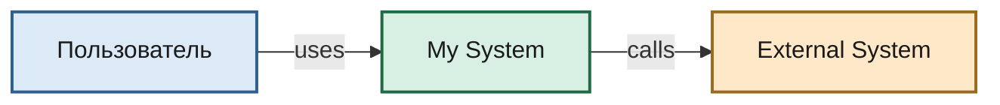
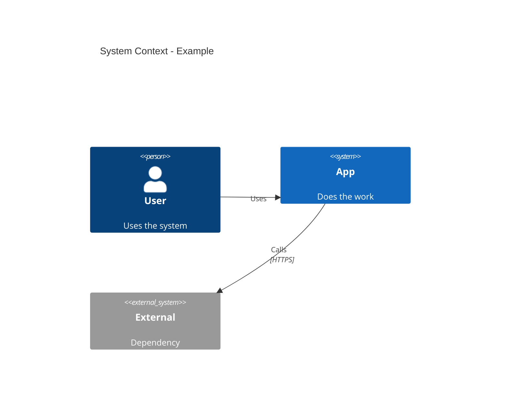

# C4 Architecture Documentation

Generate software architecture docs with the C4 model (Context, Container, Component, Deployment, Dynamic).

Source adapted from [softaworks/agent-toolkit c4-architecture](https://github.com/softaworks/agent-toolkit/tree/main/skills/c4-architecture).

## Workflow

1. **Understand scope** — which C4 level(s) for the audience
2. **Analyze codebase** — containers, components, relationships
3. **Generate diagrams** — see **Rendering rule** below
4. **Document** — write markdown with short captions

## Rendering rule (mandatory for this workspace style)

Native Mermaid `C4Context` / `C4Container` / `C4Component` **ignores** flowchart `curve`, solid-fill CSS, and often looks hatched/default-colored.

**Default:** render C4 *content* as `flowchart` with the init block from [references/style.md](references/style.md):

- square arrows: `curve: 'stepAfter'`
- solid fills only (no hatching) via `classDef` + `themeCSS`
- font: Arial
- thick strokes on edges
- unidirectional edges, informative labels

Use native `C4Context` / `C4Container` only if the user explicitly asks for Mermaid C4 syntax and accepts default C4 look.

Keep C4 *semantics* in captions and structure: Person / System / Container / Component / Db / Queue.

## C4 levels

| Level | Type | Audience | Shows | When |
|-------|------|----------|-------|------|
| 1 | Context | Everyone | System + actors + externals | Always |
| 2 | Container | Technical | Apps, DBs, queues | Always |
| 3 | Component | Developers | Internal packages | If it adds value |
| 4 | Deployment | DevOps | Nodes / clusters | Production docs |
| — | Dynamic | Technical | Numbered request flow | Complex workflows |

Context + Container is enough for most teams.

## Element checklist

Every node: **name**, **type**, **technology** (if applicable), **short description**.

Relationships:

- unidirectional only
- label with action verbs ("читает", "публикует", "scrape /metrics")
- protocol when useful (`HTTPS/JSON`, `gRPC`, `Kafka`)

Stay under ~20 elements per diagram; split if larger.

## Quick templates

### Context (styled flowchart)

Paste full `INIT_BLOCK` from [references/style.md](references/style.md) into `%%{init: ...}%%`.

### Container layout pattern

Top or left: people / UI / Kafka / external APIs / Vault·Jaeger·Pyroscope·Prometheus.  
Middle: deployable apps.  
Bottom or right: databases and caches.

Duplicate shared stores per path if that avoids edge crossings.

### Native Mermaid C4 (only on explicit request)

Syntax details: [references/c4-syntax.md](references/c4-syntax.md).

## Microservices

- One team owns service → model as **container**
- Separate team ownership → promote to **System** on context diagram
- Event-driven: show **topics/queues**, not one "Kafka" box

## Output location

Prefer project docs if present (`docs/project/`, `docs/architecture/`), else:

- `docs/architecture/c4-context.md`
- `docs/architecture/c4-containers.md`
- `docs/architecture/c4-components-{feature}.md`
- `docs/architecture/c4-deployment.md`
- `docs/architecture/c4-dynamic-{flow}.md`

## Audience

| Audience | Diagrams |
|----------|----------|
| Executives | Context |
| PM | Context + Container |
| Architects | Context + Container + key Components |
| Developers | As needed |
| DevOps | Container + Deployment |

## Anti-patterns

See [references/common-mistakes.md](references/common-mistakes.md).

## Additional resources

- [C4 model](https://c4model.com/)
- [Mermaid C4](https://mermaid.js.org/syntax/c4.html)
- Upstream skill: https://github.com/softaworks/agent-toolkit/tree/main/skills/c4-architecture
